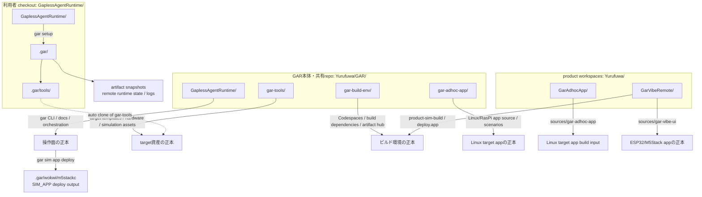
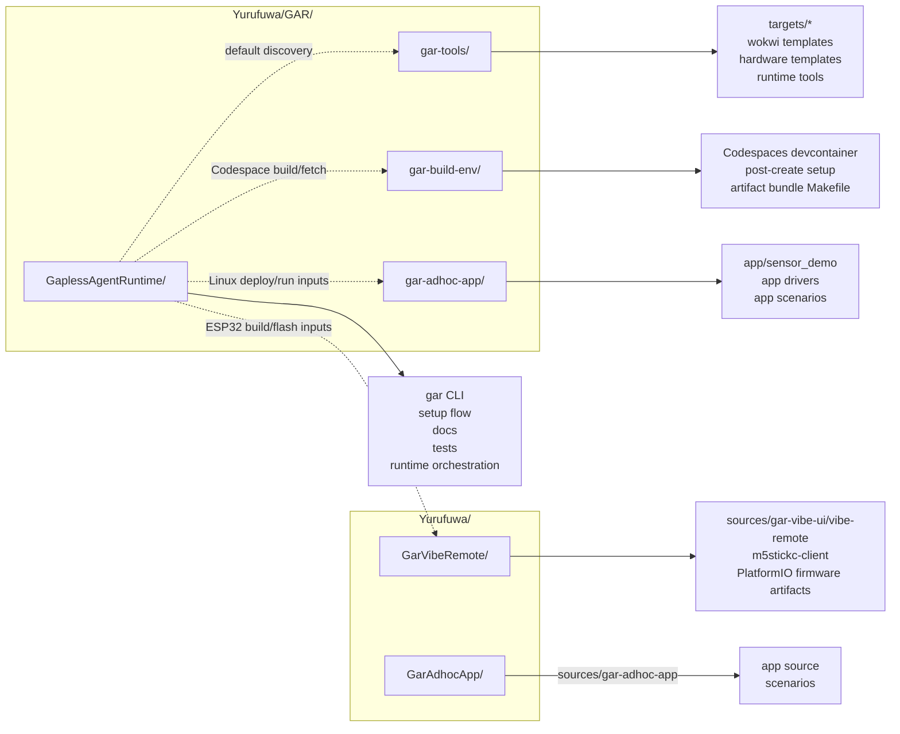
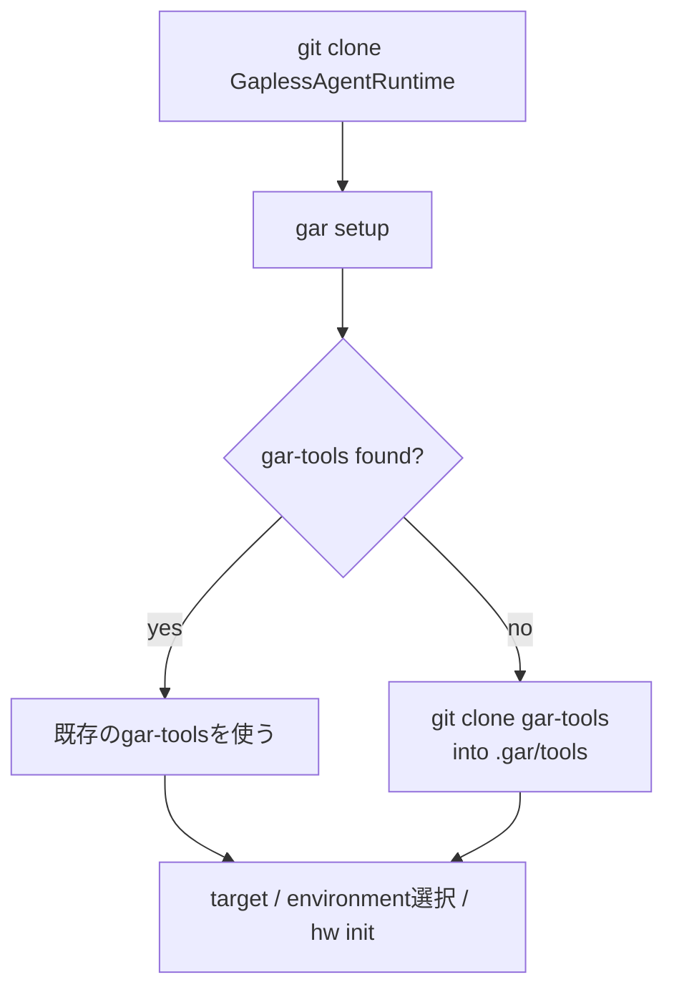
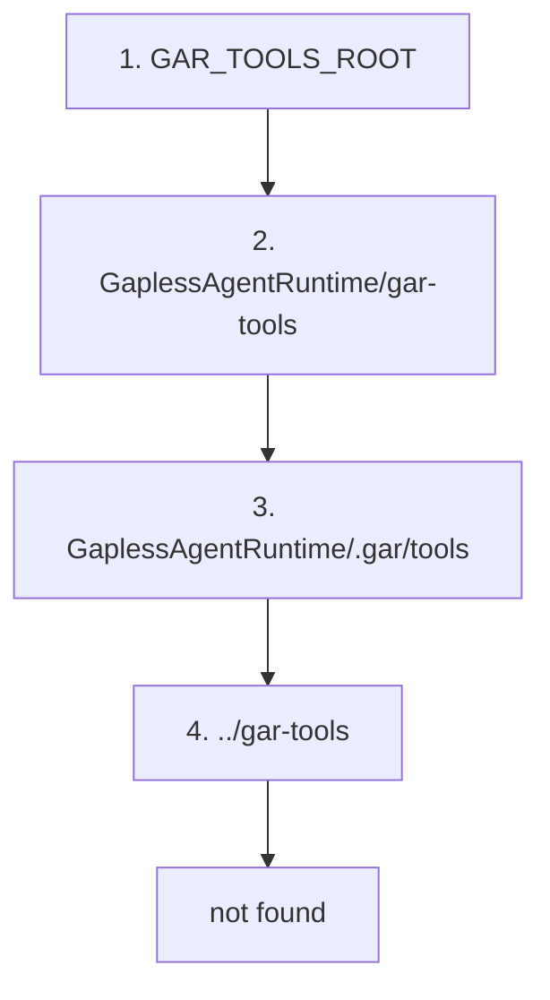
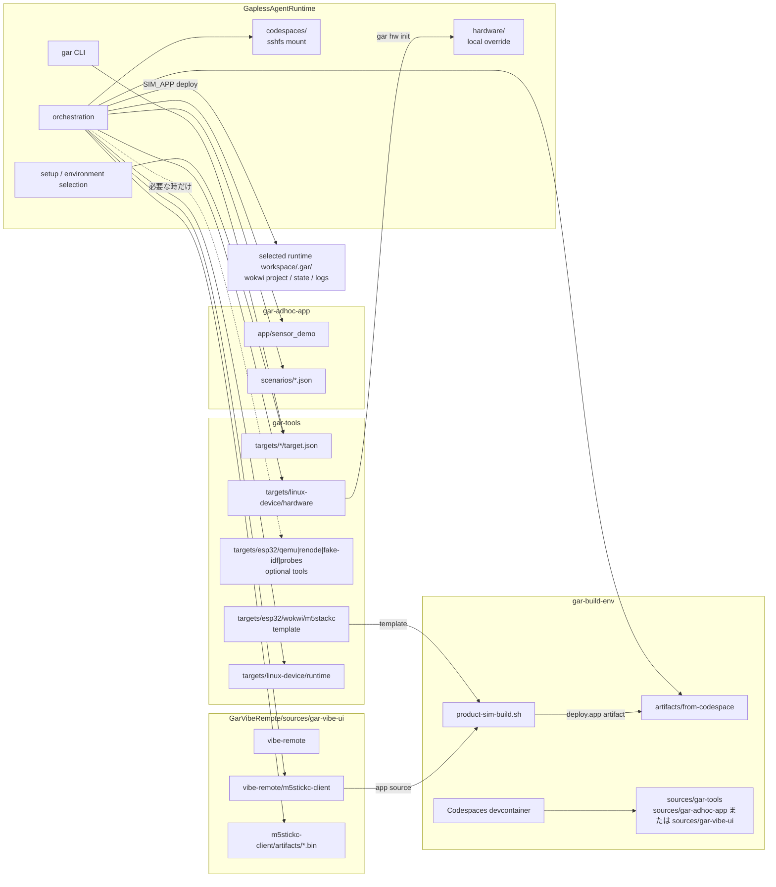
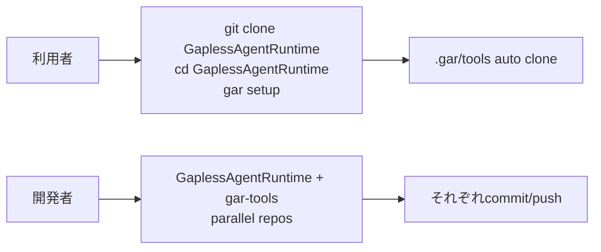

# リポジトリ配置と資産の置き場所

この資料は、`GaplessAgentRuntime`、`gar-tools`、`gar-build-env`、target app repo の関係を説明する。

結論として、GAR本体と共有repoは`Yurufuwa/GAR/`へ置き、再現可能なproduct buildは
`Yurufuwa/GarAdhocApp`や`Yurufuwa/GarVibeRemote`の`sources/` submoduleで構成する。
GARだけを利用する場合は`gar setup`が`GaplessAgentRuntime/.gar/tools`へ`gar-tools`を取得できる。

---

## 全体像



---

## GaplessAgentRuntime 内部構成

`GaplessAgentRuntime` は、target app のソースや target 固有テンプレートを持つ
リポジトリではなく、AI / 人間 / CI が各環境を同じ操作モデルで動かすための
**操作面 runtime** として設計する。

そのため、ディレクトリは大きく次の責務に分かれる。

```text
GaplessAgentRuntime/
  .gar/                    # local state / generated workspace / auto-cloned tools
  .venv/                   # local Python virtualenv
  docs/                    # operational docs and command references
  info/                    # product concept / design philosophy / future notes
  infra/                   # cloud infrastructure definitions for simulation hosts
  scripts/                 # gar CLI entrypoint and Python implementation
  tests/                   # unittest-based regression tests
  tools/                   # local helper tools bundled with GAR
  codespaces/              # optional sshfs mount created by `gar code start`
  hardware/                # optional local hardware CSV overrides
  Makefile                 # bootstrap and convenience entrypoints
  pyproject.toml           # Python lint/tool config
  requirements-gar.txt     # gar CLI runtime dependencies
  requirements-dev.txt     # make check 用の開発依存
```

| パス | Git管理 | 役割 | 設計上の位置づけ |
|---|---:|---|---|
| `scripts/gar` | yes | `gar` executable wrapper。venv を用意し、`scripts.gar_lib.cli` へ委譲する | 人間/AI が最初に触る薄い起動口 |
| `scripts/gar_lib/` | yes | GAR CLI の本体実装 | 操作面 runtime の正本 |
| `scripts/gar_lib/environments/` | yes | development / simulation / target access environment の IF と registry | `gar setup` の選択結果で差し替える拡張点 |
| `scripts/gar_lib/simulation/` | yes | simulation runtime の domain logic | environment 差し替え後も共通に使う simulation 操作 |
| `scripts/run_scenario.py` | yes | JSON scenario を bridge API へ流す補助スクリプト | AI / CI が再現可能な検証入口 |
| `docs/` | yes | 操作手順、コマンド、環境境界、引き継ぎ | 利用者が実行するための正本 |
| `info/` | yes | 背景思想、製品仮説、将来像 | なぜこの構成かを説明する非手順ドキュメント |
| `infra/terraform/` | yes | EC2 simulation host を作る Terraform と bootstrap script | simulation host のインフラ正本 |
| `tools/vscode-gar/` | yes | VS Code terminal bridge extension | AI から VS Code terminal へ依頼を渡すローカル補助 |
| `tools/gar-mcp/` | yes | GAR MCP server | 外部 agent / tool 連携用の入口 |
| `tools/*.py` | yes | port forward管理、DSM生成などの開発補助 | 状態管理や生成処理をテスト可能な形で実装 |
| `tools/*.sh` | yes | 旧コマンド互換・Python補助ツールの薄い起動口 | 主要ロジックを持たず、引数を委譲 |
| `tests/` | yes | command/domain別unittestと`tests/support/`の共通fixture | 実装変更時の挙動固定。巨大な単一CLI testへ集約しない |
| `Makefile` | yes | `make init` / `make start` / `make check` | 初回導入、日常開始、品質確認の入口 |
| `pyproject.toml` | yes | Ruff 設定 | Python 実装の静的品質設定 |
| `requirements-gar.txt` | yes | `argcomplete` など CLI 実行に必要な依存 | GAR 自体の最小依存 |
| `requirements-dev.txt` | yes | Ruffなど`make check`に必要なPython依存 | ローカル品質確認用。runtime依存とは分離 |
| `.gar/` | no | `config.json`、artifact snapshot、terminal request、generated workspace、`.gar/tools` | GaplessAgentRuntime 直下の machine-local state。`config.json` は product workspace ごとの設定を `workspaces` 配列で保存する |
| `.venv/` | no | `make init` / `scripts/gar` が作る Python venv | local execution cache |
| `codespaces/` | no | `gar code start` が作る sshfs mount | Codespace の一時的な視界。正本ではない |
| `hardware/` | no/任意 | `gar hw init` が選択中targetのテンプレートから作るローカルhardware CSV | プロジェクト固有上書き |

`app/` を置かないことが重要である。アプリケーションの正本は
`gar-adhoc-app` や `gar-vibe-ui` のようなtarget app submoduleにあり、GARは
その artifact を build / simulation / target access environment へ運ぶ。

---

## `scripts/gar_lib` の分割

`scripts/gar_lib` は `gar` CLI の実装本体だが、1ファイルに詰め込まず、
コマンド領域と差し替え IF ごとに分割する。

```text
scripts/gar_lib/
  cli.py                  # command-owned parserの合成とtop-level dispatch
  api.py                  # Gar(workspace).sim / target programmatic API
  commands/
    sim.py                # `gar sim` parser, dispatch, CLI recovery
    target.py             # `gar target` parser, dispatch, CLI recovery
    workspace_resolver.py # --workspace resolution shared by code / sim / target
    recovery.py           # connection failure to user-action translation
    code.py               # `gar code` command flow
    code_connection.py    # Codespaces検出・SSH設定・mount操作
    code_state.py         # 接続状態JSONとterminal script
    completion.py         # shell completion parser / candidates
    hw.py                 # hardware template initialization
    infra.py              # Terraform wrapper for simulator infra
    setup/
      command.py          # setup全体のphase orchestration
      workspace_setup.py  # product workspace登録
      target_setup.py     # target manifest選択・接続設定
      environment_setup.py # environment選択・依存確認
    terminal.py           # VS Code terminal request writer
    usb.py                # usbipd / USB helper command
  core/                   # shared config, typed workspace settings, archive safety, errors
  access/                 # reusable SSH / ADB / AWS / Docker capabilities
  artifacts/              # artifact manifest and store
  build/                  # local / Codespaces build environmentsとproduct hook spec
  simulation/             # setup selectionからsimulation object graphを構成
    composition.py        # selected simulator IDから各役割の実装を組み立てる
    runtime/              # artifactを動かすsimulation environment
      contract.py         # SimulationEnvironment protocol
      process.py          # process identity、atomic state、file lock
      linux_commands.py   # Linux/systemd command builderとGPIO計画
      linux_systemd.py    # Linux/systemd runtime
      wokwi.py            # Wokwi runtime
      mujoco.py           # MuJoCo runtime
    host/                 # container / VM lifecycle
      contract.py         # SimulationHostController protocol
      docker.py           # local Docker host
      aws_ec2.py          # EC2 host
      docker_spec.py      # target manifestからDocker形状を解決
      ssh_config.py       # remote hostのSSH alias更新
    hardware/             # virtual hardware control plane
      control.py          # protocolとLinux bridge control
      mujoco.py           # MuJoCo bridge control
      io_actions.py       # 共通H/W操作語彙
    diagnostics/          # diagnostic modelとoutput parser
    session/              # session managerとremote session処理
  target/
    manifest.py           # target manifest discoveryとprovisioning recipe解決
    composition.py        # target environment・OS recipeのcomposition
    environment.py        # prepare/deploy protocol
    file_transfer.py      # ADB/SSH file deployと限定sudo application install
    ssh_prepare.py        # Target所有recipeの一時転送・対話実行
    esp32.py              # ESP32 artifact installer
    esp32_firmware.py     # ESP32 flash artifact layout
    esptool.py            # ESP32 serial flashing
  environments/
    discovery.py          # category registryを検証・整列
    installers/           # Renode/AWS SSM等の共有installer
    registry/             # categoryごとの明示的ENVIRONMENT_OPTIONS
  vscode/
    terminal_ui.py        # shared terminal UI helpers
    profile_manage.py     # VS Code terminal profile write/remove
    terminal_bridge.py    # VS Code Terminal Bridge extension install
    terminal_requests.py  # request model・atomic publish・garbage collection
```

役割の分け方は次の通り。

| 種類 | ファイル/ディレクトリ | 責務 |
|---|---|---|
| CLI 表面 | `cli.py`, `commands/*.py` | root parserの合成と、各commandが所有するparser・CLI表示・adapter |
| 内部API | `api.py` | Workspace・artifact・simulation/target domainの協調。構造化結果を返し、表示しない |
| 共有基盤 | `core/` | `.gar/config.json`、typed Workspace settings、Artifact、domain error、hardware、gar-tools探索 |
| 初期設定 | `commands/setup/` | workspace、target、environmentのphaseをファイルごとに分離 |
| target 定義 | `target/manifest.py`, `core/tools_repository.py` | `gar-tools/targets/*/target.json` の探索、provisioning recipe解決、auto clone |
| code 環境 | `commands/code.py` | Local / Codespaces の開発環境操作。setupで保存した選択を読み、対応する操作を実行する |
| simulator 環境 | `api.py` + `simulation/*` + `access/*` | VM / Wokwi / MuJoCo 等の simulation runtime 操作 |
| target 環境 | `api.py` + `target/*` + `access/*` | 実機へのartifact配置、ADB/SSH/esptool差し替え、Target/OS recipeによるprepare |
| SSH/systemd Target | `target/file_transfer.py`, `target/ssh_prepare.py` | `/opt/gar/apps/<app>/run`の限定sudo配置と共通boot service有効化。OS依存script本体はgar-tools側 |
| target 固有処理 | `target/esp32.py`, `target/esp32_firmware.py`, `target/esptool.py` | ESP32 artifact layoutの検証とesptoolによる実機書き込み。buildはproduct hook |
| インフラ | `commands/infra.py`, `simulation/host/aws_ec2.py`, `access/aws.py` | Terraform実行、EC2 instance lifecycle、AWS CLIアクセス |
| ローカル補助 | `commands/terminal.py`, `commands/usb.py`, `vscode/profile_manage.py`, `vscode/terminal_bridge.py`, `vscode/terminal_ui.py` | VS Code terminal bridge、settings、USB、表示 |

`cli.py` は command line の形を決める場所に留め、実行処理はcommandと専用domainへ
渡す。`environments/registry/*` はsetupの選択肢・依存確認・導入だけを担当し、
`EnvironmentSetupOption` からruntime commandを実行しない。

---

## Environment registry の考え方

環境差し替えは `scripts/gar_lib/environments/` に集約する。

```text
scripts/gar_lib/environments/
  setup_option.py         # setup option metadata / dependency installation
  install.py              # setup時のsudo / Terminal Bridge補助
  discovery.py            # 明示registryの検証と表示順整列
  installers/
    aws_ssm.py            # AWS CLI / SSM plugin導入
    renode.py             # Renode archive導入
  registry/
    codespace/
      github_codespaces.py
      local_docker.py
    simulator/
      local_docker.py
      ssh_remote.py
      wokwi.py
      mujoco.py
      renode_mcu.py
      esp32_qemu.py
      aws_ssm.py
    target/
      adb_usb.py
      adb_win.py
      esp32_esptool.py
      ssh_scp.py
```

`gar setup` は environment を category ごとに選び、`.gar/config.json` の
`selected_environments` に保存する。

| category | 代表選択肢 | 実行時の解決先 |
|---|---|---|
| `codespace` | `github_codespaces`, `local` | `commands/code.py` / `build/` |
| `simulator` | `local_docker`, `ssh_remote`, `wokwi`, `mujoco`, `renode_mcu`, `esp32_qemu_firmware`, `aws_ssm` | `simulation/composition.py` |
| `target` | `adb_usb`, `adb_win`, `ssh_scp`, `esp32_esptool` | `target/` |

各categoryの`__init__.py`が`ENVIRONMENT_OPTIONS`を明示し、root registryが結合する。
reflectionやpackage scanには依存しない。registryの選択IDは実行時resolverへの入力になるが、registry class自体は実行処理を
持たない。新しい接続方式を増やす場合は、setup用registry entryに加えて、対応する
`access/` channelと`simulation/`または`target/` resolverを追加する。

---

## Simulation domain logic

`scripts/gar_lib/simulation/` は simulator environment の背後にある domain logic を置く。

```text
scripts/gar_lib/simulation/
  composition.py          # setupで選ばれたIDからruntime / host / hardwareを構成
  runtime/
    contract.py           # SimulationEnvironment interface
    linux_commands.py     # Linux/systemd command builder
    linux_systemd.py      # Linux/systemd runtime
    wokwi.py              # Wokwi runtime
    mujoco.py             # MuJoCo runtime
    pending.py            # error-only runtime共通実装
    renode.py             # Renode runtime stub
    esp32_qemu.py         # ESP32 QEMU runtime stub
    aws_ssm.py            # AWS SSM runtime stub
    process.py            # local process capability
  host/                   # Docker / EC2 lifecycleとSSH設定
  hardware/               # Linux / MuJoCo control planeと共通I/O語彙
  diagnostics/            # diagnostic modelとparser
  session/                # VS Code terminal profileとport forward
```

ここは「どの transport で接続するか」ではなく、「simulation runtime をどう起動し、
どう診断し、どう GPIO/I2C/SPI bridge と話すか」を扱う。たとえば SSH 接続でも
AWS SSM 接続でも、Linux/systemd runtime の操作はできるだけ同じ builder を使う。

---

## Local/generated directories

次のディレクトリは利用時に生成されるか、環境依存の一時状態を置く。
Git の正本として扱わない。

| パス | 作られるタイミング | 中身 |
|---|---|---|
| `.gar/config.json` | `gar setup` | target、environment、host、serial portなどのlocal config。選択contextはmodule globalへ保持しない |
| `.gar/tools/` | `gar setup` | `gar-tools` が見つからない場合の auto clone 先 |
| `.gar/artifacts/<workspace-id>/<kind>/<build-id>/` | build / fetch | workspace・artifact種別ごとの不変snapshotと`latest.json` |
| `<runtime-workspace>/.gar/wokwi/` | `gar sim app deploy` | SIM_APP artifact から展開した runnable Wokwi project。local接続ではproduct workspace、remote buildではGAR管理下に置く |
| `.gar/mujoco/` | MuJoCo app deploy/start | materializeしたmodel/runner、process state、log |
| `.gar/terminal-requests/` | `gar terminal run` / setup handoff | VS Code terminal bridge への実行要求 JSON |
| `.gar/mcp-config.json` | `make init` | MCP server 設定例 |
| `.venv/` | `make init` または `scripts/gar` 初回実行 | GAR CLI 用 Python venv |
| `codespaces/` | `gar code start` | Codespaces workspace の sshfs mount |
| `hardware/` | `gar hw init` | 選択中targetの hardware CSV のローカル上書き |

この分離により、同じ repository checkout を使っても、ユーザーごとの environment 選択や
接続先、生成 workspace は Git の差分として混ざらない。

---

## 開発時の配置

GAR本体・共有repoは`Yurufuwa/GAR/`に並べ、product workspaceは`Yurufuwa/`直下に置く。
product workspaceは`gar-build-env`を土台とし、appと`gar-tools`をsubmoduleとして保持する。



代表的な配置:

```text
Yurufuwa/
  GAR/
    GaplessAgentRuntime/
    gar-tools/
    gar-build-env/
    gar-adhoc-app/
  GarAdhocApp/
    sources/gar-adhoc-app/
    sources/gar-tools/
  GarVibeRemote/
    sources/gar-vibe-ui/
    sources/gar-tools/
```

---

## 利用時の配置

利用者は `GaplessAgentRuntime` だけをcloneして始められる。
`gar setup` は `gar-tools` が見つからない場合、`.gar/tools` に取得する。



利用者側の生成後イメージ:

```text
GaplessAgentRuntime/
  .gar/
    config.json
    artifacts/              # workspace / kind / build-id snapshots
    tools/                  # gar setup が取得する gar-tools
    wokwi/
      <workspace-id>/       # remote build用のdeploy先（localはproduct workspace側）
  codespaces/               # gar code start が作る sshfs mount（必要時）
  hardware/                 # gar hw init で作るローカル上書き（必要時）
  scripts/
  docs/
```

`.gar/` はローカル状態、外部ツール、テンプレート展開済み workspace、ログの置き場なので、Git管理しない。
アプリケーションのソースは `GaplessAgentRuntime/app` には置かず、
product workspace内のtarget app submodule（例: `GarAdhocApp/sources/gar-adhoc-app/app`、
`GarVibeRemote/sources/gar-vibe-ui/vibe-remote/m5stickc-client`）を正本にする。

---

## 探索順

`GaplessAgentRuntime` は、次の順番で `gar-tools` を探す。



この順番にしている理由:

| 順位 | 場所 | 意図 |
|---:|---|---|
| 1 | `GAR_TOOLS_ROOT` | 開発者・CIが明示した場所を最優先する |
| 2 | `GaplessAgentRuntime/gar-tools` | 手動で内側に置いた構成を許容する |
| 3 | `GaplessAgentRuntime/.gar/tools` | `gar setup` の自動取得先 |
| 4 | `../gar-tools` | 開発時の兄弟リポジトリ配置 |

---

## 資産の責務



責務の分け方:

| 種類 | 正本 | ローカル生成先 |
|---|---|---|
| target manifest | `gar-tools/targets/*/target.json` | なし |
| Wokwi workspace template | `gar-tools/targets/esp32/wokwi/m5stackc/` | product hookの一時build workspaceからSIM_APP artifactへ格納 |
| Wokwi runnable project | `.gar/artifacts/<workspace-id>/sim_app/<build-id>/` | `gar sim app deploy`で`<runtime-workspace>/.gar/wokwi/`へ展開 |
| ESP32 optional tools | `gar-tools/targets/esp32/{qemu,renode,fake-idf,probes}/` | 必要時のみ |
| Linux hardware CSV template | `gar-tools/targets/linux-device/hardware/` | `hardware/` |
| target app source | `GarAdhocApp/sources/gar-adhoc-app/app/` | build artifact |
| app scenario | `GarAdhocApp/sources/gar-adhoc-app/scenarios/` | remote scenario copy |
| Codespaces build hub | `gar-build-env`由来のproduct workspace | `codespaces/` sshfs mount |
| ESP32/M5Stack firmware source | `GarVibeRemote/sources/gar-vibe-ui/vibe-remote/m5stickc-client/` | product hookが`.bin` bundleをstaging |
| ESP32/M5Stack firmware artifact | `.gar/artifacts/<workspace-id>/target_app/<build-id>/` | esptool flash input |
| Runtime state / logs | なし | `.gar/` |

`hardware/` はプロジェクト固有の上書きとして扱う。標準テンプレートの正本は
`gar-tools` 側に置く。
`app/` は target app repo の責務なので、`GaplessAgentRuntime` には置かない。
`codespaces/` は `gar code start` が作るローカル mount なので、正本ではなく一時的な視界として扱う。

Wokwi も同じ考え方にする。`gar-tools` は配線、shim、`*.template`、generator
の正本を持ち、アプリソースとbuild hookはproduct workspaceが持つ。Vibe Remote
では`GarVibeRemote/scripts/product-sim-build.sh`が両者を一時build workspaceで
合成・ビルドし、runnable fileを`deploy.app` artifactへ格納する。GARはartifactを
captureし、`gar sim app deploy`で選択中のruntime workspaceへ展開する。
`gar setup`と`gar sim runtime start`はgeneratorを呼ばない。共有Wokwi scenarioは
現在提供しておらず、必要なscenarioは製品側が所有してartifactへ明示的に含める。

---

## なぜGAR本体にgar-tools submoduleを持たないか



GAR本体が`gar-tools`をGit submoduleにすると、利用者が`--recurse-submodules`や
`git submodule update --init` を意識する必要が出る。GARの狙いはセットアップを
`gar setup` に集約することなので、submodule より `.gar/tools` 自動取得のほうが
操作モデルが単純になる。なお、再現可能なbuild contextを作るproduct workspaceでは、
appと`gar-tools`を`sources/`配下のsubmoduleとして明示的に固定する。
